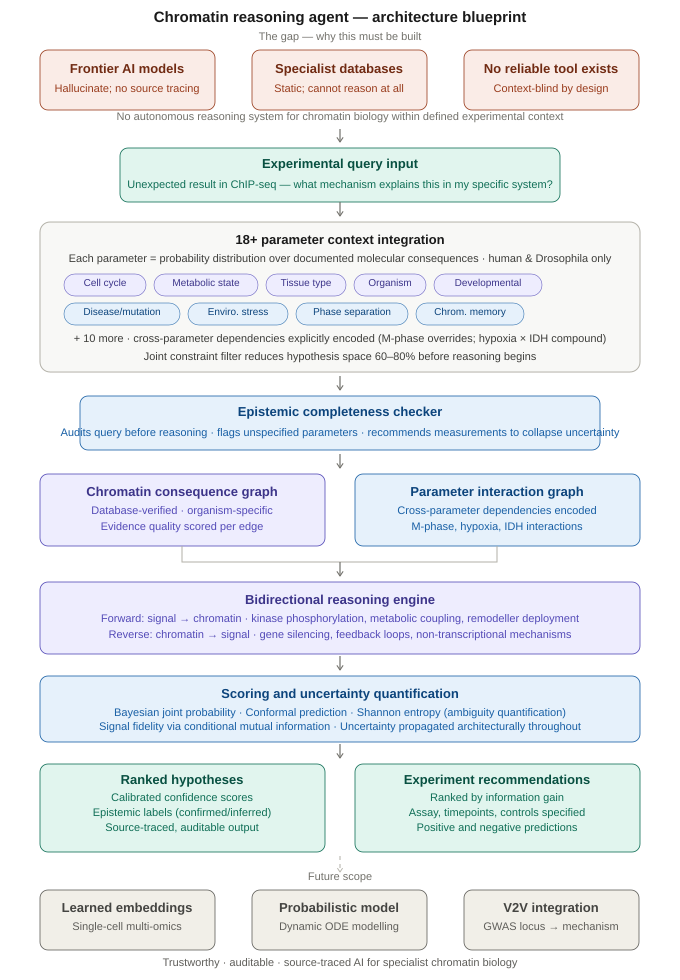

# EpiSignal

**Context-aware mechanistic reasoning agent for chromatin biology**

Status: Architecture and framework in active development
Author: Mujtaba Ahmed, Tariq Lab, LUMS

---

## Background and motivation

This project came out of a practical problem I encountered repeatedly during my research. When a ChIP-seq experiment returns an unexpected result, there is no computational tool that helps you reason through what caused it given your actual experimental conditions. You can query STRING or PhosphoSitePlus for interaction data, you can browse Reactome for pathway context, and you can ask a general-purpose AI model and receive a confident, fluent answer that mixes confirmed mechanisms with plausible inventions in a way that is genuinely difficult to untangle. None of these is what you actually need, which is a system that takes your specific observation and your specific context and produces ranked, mechanistically grounded hypotheses you can actually test.

The deeper problem is that all existing tools are built around the same assumption: signalling is upstream and chromatin is downstream. The entire architecture of STRING, Reactome, and PhosphoSitePlus reflects this. It is a real biological oversimplification. Chromatin state actively regulates signalling pathway activity through multiple well-documented mechanisms, including transcriptional control of pathway genes, non-transcriptional modification of kinase-proximal proteins, and feedback loops where chromatin-driven gene expression changes amplify or suppress the same signals that drove the chromatin change in the first place. A tool that cannot reason in both directions is architecturally incomplete for the questions chromatin biologists actually ask.

EpiSignal is designed to reason in both directions, within a defined biological context, with calibrated confidence, and with full source tracing on every claim it makes.

---

## Connection to experimental work

The immediate motivation for this project is my ongoing work on Ballchen (BALL), the Drosophila H2A threonine 119 kinase and Trithorax group protein, in the Tariq Lab at LUMS. BALL is a genuine bidirectional regulatory node and a useful validation case for the kind of reasoning EpiSignal is designed to support.

In the forward direction, BALL phosphorylates H2A at T119 at PRE-proximal loci, displacing the PRC1 E3 ligase dRING from the nucleosome acidic patch, reducing H2AK118 ubiquitination, and contributing to derepression of Polycomb target genes. My ChIP-seq data from S2 cells shows that BALL predominantly localises at insulator elements, co-occupying sites with dCTCF, CP190, and BEAF-32, which raises the question of whether BALL-mediated H2AT119 phosphorylation at TAD boundary regions affects loop extrusion and boundary insulation independently of its role at PRE-proximal loci.

That question is a reverse-chain question. If H2AT119 phosphorylation density at TAD boundaries regulates boundary insulation, then the chromatin modification state is upstream of the three-dimensional genome organisation, which in turn controls which enhancer-promoter pairs are in proximity, which determines the expression of signalling pathway genes, which feeds back to the signalling state of the cell. Reasoning through that chain systematically, with organism-specific evidence, organism-appropriate priors, and a ranked experimental recommendation, is precisely what EpiSignal is built to do. Hi-C in BALL-depleted Drosophila S2 cells is the experiment the system would recommend first for testing this hypothesis.

---

## Why this gap exists now

Frontier AI models are already being used by researchers to reason about chromatin biology. The use is happening regardless of whether the tools are reliable enough to support it. The problem is that models like GPT-4 and Claude produce syntactically expert, biologically fluent answers that are partially wrong in ways that are very difficult to detect without deep domain knowledge of the specific mechanism being discussed. The hallucination is not obvious. It sounds like a knowledgeable colleague.

The specific failure modes are consistent and predictable: incorrect cross-organism extrapolation applied without conservation evidence, outdated mechanistic consensus presented as settled, enzyme-substrate relationships that do not exist in the relevant organism stated confidently, and no quantitative effect sizes reported alongside mechanistic claims. These are not random errors. They reflect the structural limitations of a general-purpose language model applied to a domain where the relevant evidence is scattered across dozens of specialist databases, where context specificity is biologically critical, and where the difference between a correct and an incorrect hypothesis can determine whether six months of experiments produce meaningful data.

EpiSignal addresses this by encoding source tracing, organism-specific evidence weighting, and calibrated uncertainty quantification as architectural requirements rather than optional features.

---

## Core design principles

**Source tracing as a requirement, not a feature.** Every mechanistic claim in an EpiSignal output is linked to a specific database record or publication. Claims without database support are labelled explicitly as predicted or speculative. There is no mechanism by which the system can produce a confident unsourced assertion.

**Organism discipline.** A mechanism established in Drosophila S2 cells is not assumed to apply in human cells without documented conservation evidence. Cross-organism priors are quantified, stated explicitly, and adjusted based on the available evidence for ortholog identity, domain conservation, and functional equivalence. The base prior for applying a Drosophila mechanism to a human query is low and must be raised by evidence, not assumed.

**Parameters as probability distributions.** Each of the 18+ context parameters the system loads is treated as a probability distribution over documented molecular consequences, not a categorical label. Hypoxia is not a flag that turns on HIF1-alpha. It is a distribution over oxygen concentrations, alpha-KG depletion levels, TCA cycle activity states, and AMPK activation levels, each with different chromatin consequences at different severities. Where the user has measured these directly, the distribution is narrow. Where they have not, it is wide, and the output reflects that width explicitly.

**Cross-parameter interactions encoded explicitly.** The most important sources of false precision in existing tools are unacknowledged parameter interactions. M-phase transcriptional silencing overrides all other pathway activity states regardless of what signalling is happening. Hypoxia and IDH mutation inhibit JmjC demethylase activity through independent mechanisms whose effects compound multiplicatively, not additively. These interactions are encoded as explicit dependencies in the Parameter Interaction Graph, not inferred on the fly.

**Uncertainty surfaced, not hidden.** The Epistemic Completeness Checker audits every query before reasoning begins, identifies which parameters are unspecified or poorly characterised, and outputs specific measurement recommendations. A researcher querying H3K27me3 dynamics in a cancer cell line without specifying IDH mutation status or oxygen concentration is told what to measure before a potentially misleading ranking is returned. The goal is to make the system's limitations visible and actionable rather than invisible and dangerous.

---

## Architecture overview

The full architecture is described in detail in the documents in this repository. The core components are as follows.

The **Chromatin Consequence Knowledge Graph** encodes biological states as sub-graphs of documented molecular consequences. Each node corresponds to a biological entity or state with an organism tag. Each edge carries a mechanism type annotation, an evidence quality score derived from experimental method and replication count, and a severity-dependent weight where relevant. The graph is deliberately scoped to human and Drosophila for the initial build.

The **Parameter Interaction Graph** is a curated set of known cross-parameter dependencies for the core 18+ parameters, covering the interactions where treating parameters as independent produces qualitatively wrong outputs.

The **Epistemic Completeness Checker** runs before any reasoning and converts knowledge gaps into explicit experimental guidance. This is one of the most immediately practical components because it provides value even when the hypothesis ranking itself is uncertain.

The **Bidirectional Reasoning Engine** traverses the knowledge graph in both the forward direction (signal to chromatin) and the reverse direction (chromatin to signal) simultaneously, applying the parameter constraints and cross-parameter interaction rules at each step.

The **Scoring Framework** integrates Bayesian joint probability scoring with conformal prediction and entropy balancing to produce calibrated confidence guarantees. Shannon entropy of the hypothesis score distribution quantifies the remaining ambiguity and directly determines the information gain ranking of experimental recommendations.




---

## Current status

This repository contains the architectural framework, the design documentation, and the conceptual basis for the system. Implementation of the core reasoning pipeline is the planned next phase. The architectural design has gone through substantial critical revision, including the transition from a categorical parameter system to a probability distribution model, the identification of cross-parameter interaction encoding as a distinct architectural requirement, and the scoping decision to restrict initial coverage to human and Drosophila to prioritise depth over breadth.

---

## Future directions

The near-term implementation target is a prompt-based reasoning agent for human and Drosophila chromatin biology, validated retrospectively against published landmark papers in the field and prospectively through experimental predictions from my own lab work.

The medium-term direction is replacing the manually curated knowledge graph nodes with learned chromatin state embeddings trained on single-cell multi-omics data, which would allow the parameter system to grow beyond what manual curation can enumerate.

The longer-term direction includes integration with the Vector2Variant tool (Sooknah et al. 2026) for automated reasoning from GWAS loci to chromatin mechanisms, and a prospective validation pipeline where experimental results from the Tariq Lab update the system's priors in a structured feedback loop.

---

## Repository contents

```
architecture/
    EpiSignal_Architecture_Document_v1.md
    system_prompt_v1.md

framework/
    parameter_framework.md
    knowledge_graph_design.md
    scoring_framework.md

figures/
    architecture_blueprint.svg

README.md
```

---

## Contact

Mujtaba Ahmed
MS in Biology, LUMS
Tariq Lab, Epigenetics and Chromatin Biology
22140008@lums.edu.pk
